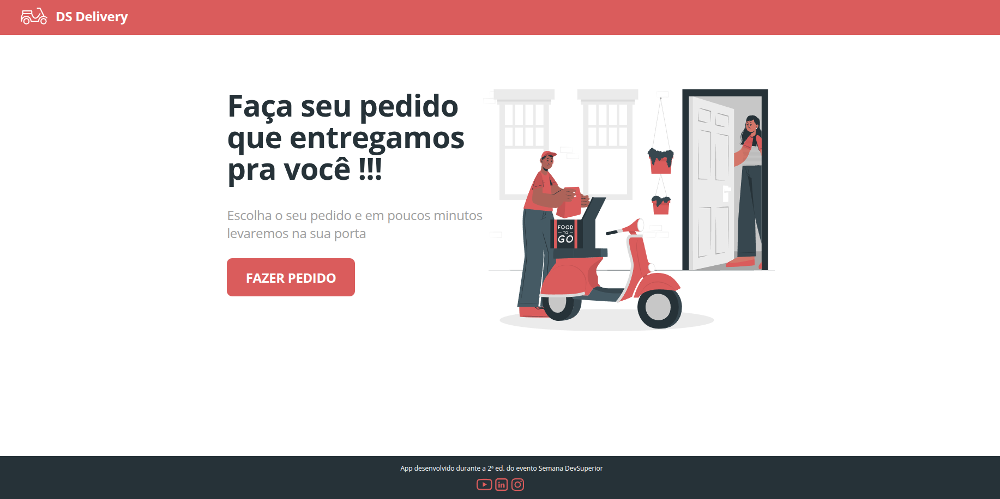

# DS Deliver Frontend


[](https://app.netlify.com/projects/sds2-delivery-food/deploys)

Frontend da aplicação **DS Deliver**, uma plataforma web para visualização de produtos e envio de pedidos.

Este projeto consome uma **API REST** responsável pelo processamento dos pedidos e persistência dos dados.

---

# Preview



---

# Tecnologias utilizadas

* React
* TypeScript
* Axios
* HTML
* CSS
* Node.js
* Yarn / npm

---

# Arquitetura da aplicação

```text
Browser
   |
   v
React Frontend
   |
   v
REST API
   |
   v
Database
```

Responsabilidades do frontend:

* Renderização da interface
* Consumo da API REST
* Seleção de produtos
* Envio de pedidos

---

# Funcionalidades

* Listagem de produtos
* Seleção de itens
* Envio de pedidos
* Interface responsiva
* Comunicação com API REST

---

# Como executar o projeto

## 1 - Clonar o repositório

```bash
git clone https://github.com/Lubrum/dsdeliver-sds-frontend.git
cd dsdeliver-sds-frontend
```

---

## 2 - Instalar dependências

Com npm:

```bash
npm install
```

ou com yarn:

```bash
yarn install
```

---

## 3 - Executar o projeto

```bash
npm start
```

ou

```bash
yarn start
```

A aplicação será iniciada em:

```
http://localhost:3000
```

---

# Configuração da API

A URL da API pode ser configurada em:

```
src/services/api.ts
```

Exemplo:

```typescript
const BASE_URL = "http://localhost:8080";
```

---

# Estrutura do projeto

```
src
 ├── components
 ├── pages
 ├── services
 ├── types
 ├── utils
 ├── App.tsx
 └── index.tsx
```

---

# Integração com backend

Este frontend foi desenvolvido para consumir uma API REST que fornece endpoints para:

* listar produtos
* registrar pedidos

---

# Autor

Luciano Brum

GitHub
https://github.com/Lubrum

Website
https://lubrum.github.io

---

# Licença

Este projeto está licenciado sob a **MIT License**.
